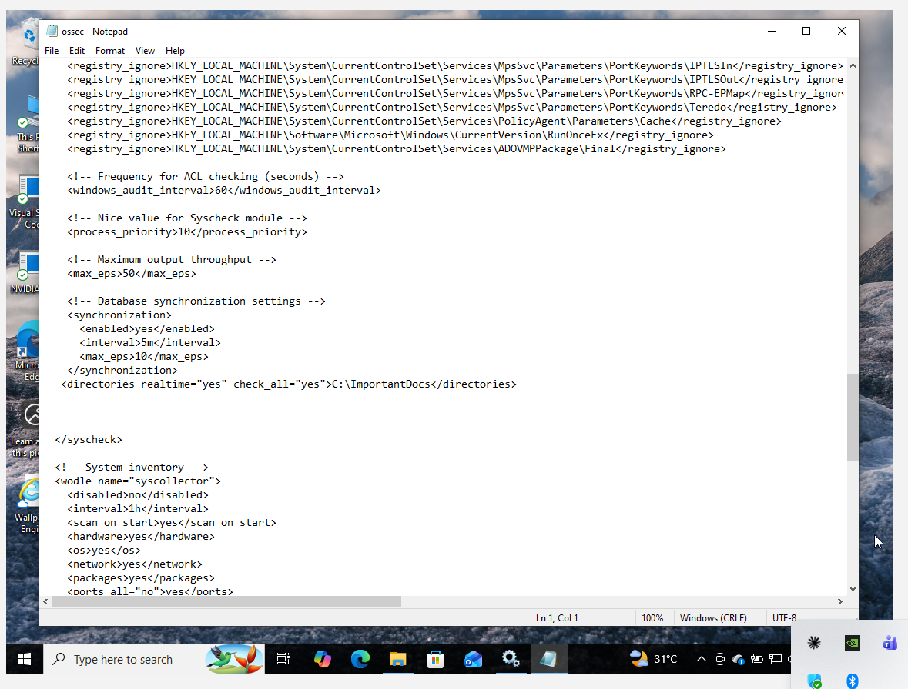
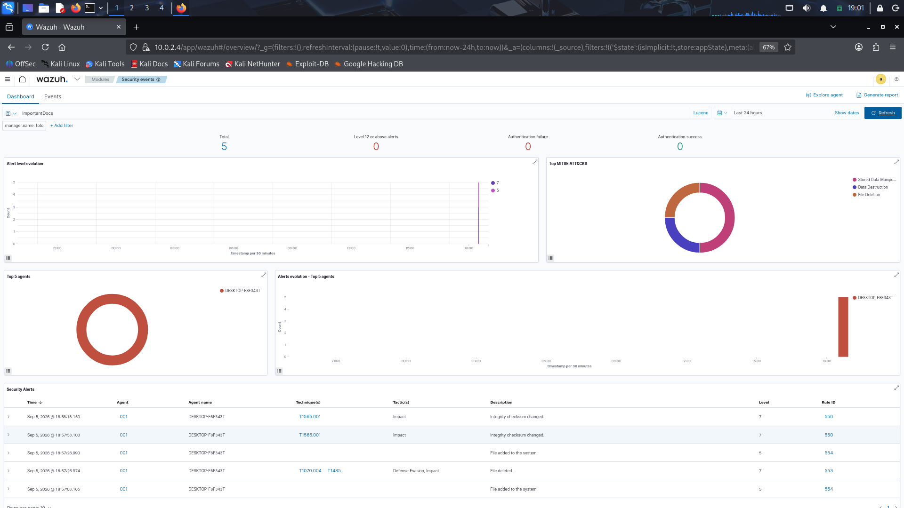
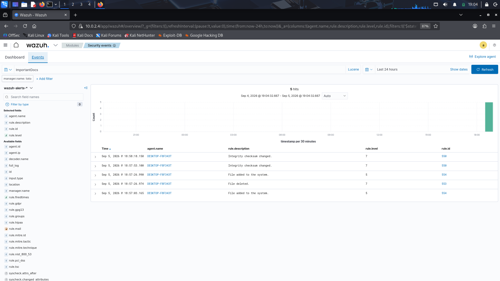

# File Integrity Monitoring (FIM) — Wazuh EDR-Style Capability

## Overview
Simulated file tampering activity on the `demoWIN` endpoint to test and validate 
Wazuh's File Integrity Monitoring (FIM) capability, demonstrating EDR-like 
detection using built-in syscheck functionality — without requiring a separate 
EDR tool.

## Lab Environment
| Component | Details |
|---|---|
| Target Endpoint | demoWIN (Windows 10, 10.0.2.3) |
| Monitored Directory | C:\ImportantDocs |
| Wazuh Manager | Ubuntu Server, 10.0.2.4 |
| Detection Method | Wazuh syscheck (FIM) module |

## Configuration
Added the following to the Wazuh agent's `ossec.conf` on demoWIN:

```xml
<directories realtime="yes" check_all="yes">C:\ImportantDocs</directories>
```

Restarted the Wazuh Agent service to apply changes.



## Simulation Steps
1. Created dummy files (`passwords.txt`, `financial_report.txt`) inside `C:\ImportantDocs`
2. Edited file contents to simulate data manipulation
3. Deleted a file to simulate evidence destruction
4. Created a new file to simulate unauthorized file drop

## Detection Results
5 alerts generated within seconds of each simulated action:

| Time | Action | MITRE Technique | Tactic | Rule ID |
|---|---|---|---|---|
| 18:57:03 | File added | — | — | 554 |
| 18:57:26 | File deleted | T1070.004 (Indicator Removal: File Deletion), T1485 (Data Destruction) | Defense Evasion, Impact | 553 |
| 18:57:26 | File added | — | — | 554 |
| 18:57:53 | File content modified | T1565.001 (Stored Data Manipulation) | Impact | 550 |
| 18:58:18 | File content modified | T1565.001 (Stored Data Manipulation) | Impact | 550 |




## Key Findings
- Wazuh's syscheck module successfully detected file creation, modification, 
  and deletion in real-time (realtime="yes")
- Detected activity mapped to 3 distinct MITRE ATT&CK techniques across 2 tactics
  (Defense Evasion, Impact), demonstrating the tool's ability to classify 
  attacker intent beyond simple alerting
- This validates Wazuh as capable of providing EDR-like endpoint visibility 
  without a dedicated EDR platform

## Next Steps
- Configure Active Response to automate remediation (e.g., alerting/blocking) 
  upon FIM-triggered events